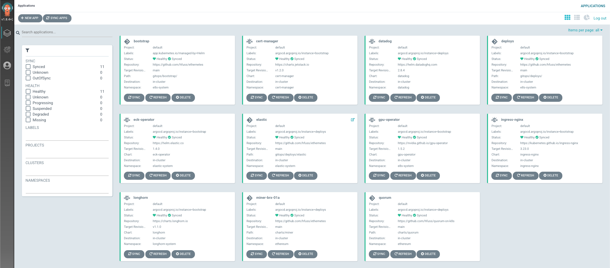
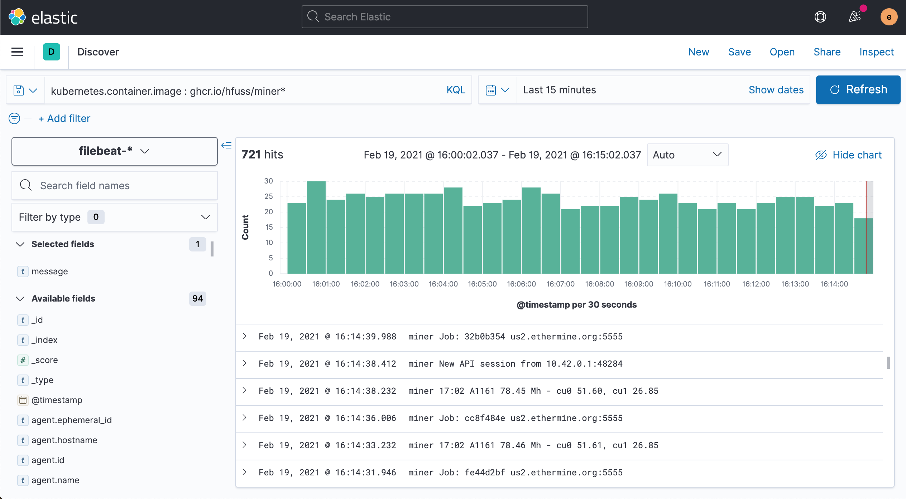

# ethernetes

Learning more about blockchain and deep learning with GPUs and K8s.

* [Getting Started](#getting-started)
  * [Requirements](#requirements)
  * [Cluster Installation and Management](#cluster-installation-and-management)
  * [Deploying a Miner](#deploying-a-miner)
    * [via ArgoCD](#via-argocd)
    * [via Helm](#via-helm)
* [Managing Apps via ArgoCD](#managing-apps-via-argocd)
* [Monitoring](#monitoring)
  * [Elastic](#elastic)
  * [DataDog](#datadog)

For more info on specific components, see the [additional docs](docs/README.md).

## Getting Started

### Requirements

- Ubuntu 18.04
- docker 20+
- k3sup 0.9+
- helm 3.5+
- kubectl 1.20+
- argocd 1.8+

### Cluster Installation and Management

Initializing the first node and ArgoCD consists of the following:

```bash
cd k3s/
./install-server.sh ethernetes.brxblx.io

# check the state of the helm release and apps for ArgoCD
export KUBECONFIG=${HOME}/.k3s/config.yaml
helm ls -n e8s-system
kubectl get pod -n e8s-system
kubectl get app -n e8s-system
```

From there you can add secrets and upgrade ArgoCD to use an Ingress with a TLS cert:

```bash
./bootstrap-server.sh ethernetes.brxblx.io
```

If you need to add a worker node:

```bash
./add-node.sh my-new-host ethernetes.brxblx.io  
```

Or to add another control node:

```bash
./add-node.sh my-new-host ethernetes.brxblx.io --server 
```

> **Note**: all args after the second positional argument are passed to the `k3sup join` command
> in case you want to provide additional configuration.

### Deploying a Miner

First, prepare the miner config for a particular host or node:

```bash
numGPUs=2
hostname=brx-01a
```

#### via ArgoCD

Any time a new host is configured by the [NVIDIA GPU Operator](https://github.com/NVIDIA/gpu-operator),
a miner using 1 GPU is automatically deployed to the existing ethernetes cluster via
an [`ExtendedDaemonSet`](https://github.com/datadog/extendeddaemonset).
To customize the number of GPUs per node you can do so  by appending to the
`ExtendedDaemonsetSettings` managed using ArgoCD and Helm:

```bash
git checkout main
git pull --rebase origin main
git checkout -b miner-${hostname}

cat <<EOF >> gitops/deploys/application-miner-hayden-desktop.yaml
            - name: ${hostname}
              nodeSelector:
                kubernetes.io/hostname: ${hostname}
              gpus: ${numGPUs}
EOF

git add gitops/deploys/application-miner-hayden-desktop.yaml
git commit -m "Deploying a New Miner to ${hostname}"
gh pr create --web --base main
```

Once the PR is merged, the miner will be deployed via [ArgoCD](https://cd.brxblx.io/applications/deploys):

```bash
argocd app sync deploys
argocd app sync miner
```

> **Note**: This process will ideally be automated by a `MiningSet` controller which auto-discovers
> the number of GPUs per node (or node selectors) and schedules miners via an `ExtendedDaemonSet`.

#### via Helm

You can deploy to a particular host on your own GPU-enabled cluster using Helm and a `StatefulSet`:

```bash
kubectl create ns ethereum
cat <<EOF > miner.yaml

miningPools:
  - us1.ethermine.org
  - us2.ethermine.org
  - eu1.ethermine.org

nodeSelector:
  kubernetes.io/hostname: ${hostname}
  
resources:
  limits:
    nvidia.com/gpu: ${numGPUs}

EOF

helm upgrade --install ethereum-miner charts/miner \
  --wait \
  -n ethereum
  -f miner.yaml

helm test --logs -n ethereum ethereum-miner
```

## Managing Apps via ArgoCD

Application manifests for ArgoCD live underneath the [`gitops/`](gitops/) folder
of this repo. You can access ArgoCD via the CLI:

```bash
argocd login --grpc-web cd.brxblx.io:443
argocd app list
```

[`gitops/bootstrap/`](gitops/bootstrap/) describes the cluster namespaces, controllers, 
and operators needed for ingress, storage and logs, TLS, and leveraging GPUs:

```bash
argocd app get bootstrap
```

[`gitops/deploys/`](gitops/deploys/) describes the namespaces and manifests for deploying the
monitoring stack (i.e. DataDog and Elastic), and the deployments of Ethereum miners,
private blockchain nodes, web apps, and more:

```bash
argocd app get deploys
```

Visit [cd.brxblx.io](https://cd.brxblx.io) to explore and manage the apps via
the UI:

<p align="center">
  
</p>

## Monitoring

### Elastic

You can see logs from all the miners in the existing cluster [here](https://search.brxblx.io/goto/48ff67e4c824ac8c67314bf8e2293212):

<p align="center">
  
</p>

Explore the cluster's logs at [search.brxblx.io](https://search.brxblx.io).

### DataDog

Using [DataDog](https://app.datadoghq.com/dashboard/hes-3t9-pq3/ethereum-miners?from_ts=1613723498904&live=true&to_ts=1613737898904),
it's easy to visualize the health of the miners with respect to the GPUs and system
resources:

<p align="center">
  
</p>
